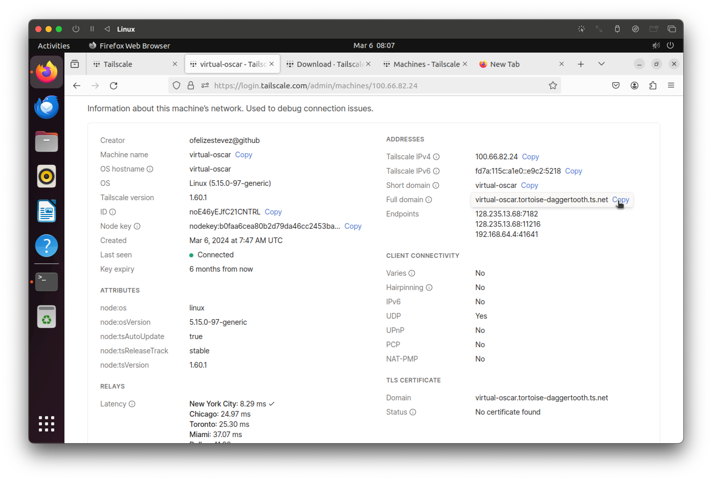
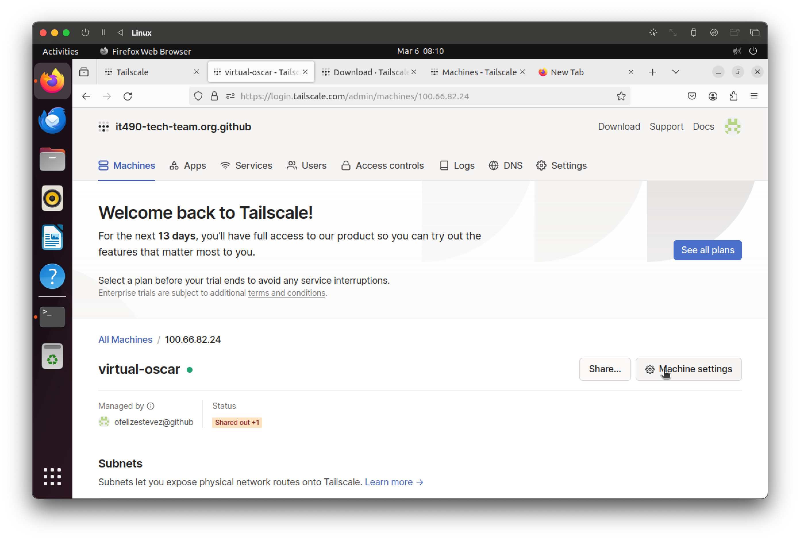
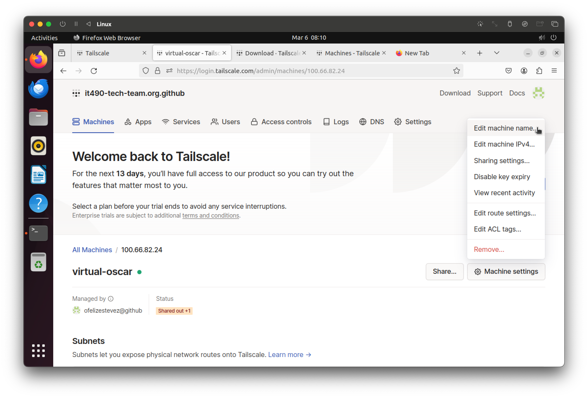
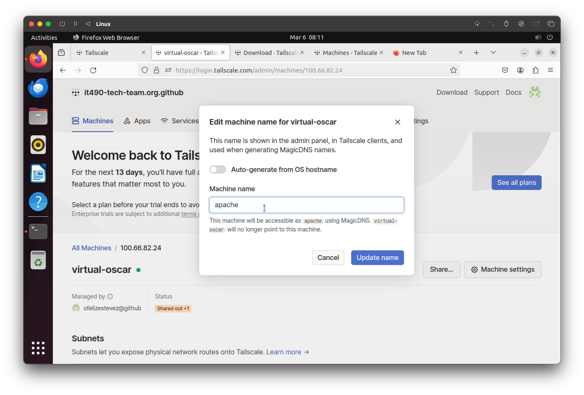
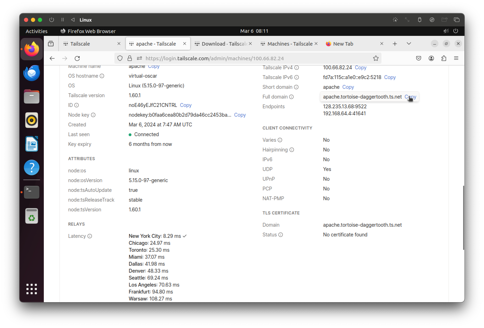

# Tailscale Machine Rename Guide

## Step 1:
Click on your machine.

## Example:
In the example, my machine is named `virtual-oscar`.

This machine currently uses the domain name `virtual-oscar.*`.

## Step 2:
Click on "Machine Settings".

## Step 3:
Click on "Edit Machine Name".

## Step 4:
Turn off "Auto-generate from OS hostname" and input a new machine name.

## Example:

In this example, I'm changing the machine host to `apache`, which makes this machine's new domain `apache.*` instead of `virtual-oscar.*`.

